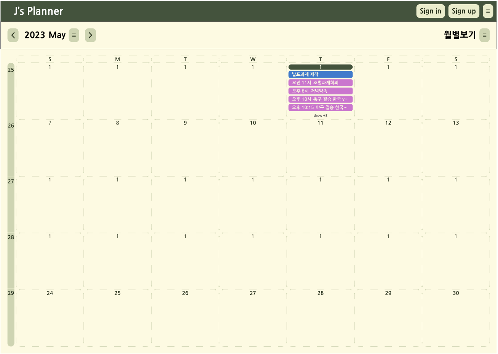

# 📅 J's Planner Frontend

> 개인 일정 관리를 위한 모던 웹 애플리케이션

React + Next.js + Redux Toolkit으로 구축된 사용자 친화적인 플래너 애플리케이션입니다.

## ✨ 주요 기능

- 📅 **월별 달력 뷰**: 직관적인 달력 인터페이스
- 🎨 **다크/라이트 모드**: 사용자 선호에 따른 테마 변경
- 🎯 **색상별 일정 분류**: 카테고리별 일정 관리
- 🔄 **실시간 동기화**: 백엔드 API와 실시간 연동
- 📱 **반응형 디자인**: 모바일/데스크톱 지원

## 📸 스크린샷



## 🛠️ 기술 스택

### Frontend
- **Framework**: Next.js 15.4.6 (App Router)
- **Language**: TypeScript
- **State Management**: Redux Toolkit
- **Styling**: Tailwind CSS
- **UI Components**: 커스텀 컴포넌트 시스템

### Development
- **Linting**: ESLint + Next.js 규칙
- **Environment**: 환경별 설정 관리 (local/test/production)

## 🚀 시작하기

### 1. 환경 설정
```bash
# 저장소 클론
git clone https://github.com/awesomedesk/j-planner-fe.git
cd j-planner-fe

# 의존성 설치
npm install

# 초기 환경 설정
npm run env:setup
```

### 2. 환경별 실행
```bash
# 기본 개발 환경 (test 환경)
npm run dev

# 로컬 개발 환경
npm run dev:local

# 프로덕션 개발 환경
npm run dev:prod

# 프로덕션 빌드
npm run build:prod
```

브라우저에서 [http://localhost:3000](http://localhost:3000)을 열어 결과를 확인하세요.

## 📁 프로젝트 구조

```
├── app/                    # Next.js App Router 페이지
│   ├── calender/          # 달력 페이지
│   └── example/           # 예시 페이지
├── components/            # 재사용 가능한 컴포넌트
│   ├── calendar/         # 달력 관련 컴포넌트
│   ├── button/           # 버튼 컴포넌트
│   └── layouts/          # 레이아웃 컴포넌트
├── utils/                # 유틸리티 함수들
│   ├── api/              # API 클라이언트 및 훅
│   └── store/            # Redux 스토어 설정
└── env/                  # 환경 설정 및 환경별 파일들
    ├── config.ts         # 환경변수 유틸리티
    └── .env.*            # 환경별 설정 파일
```

## 🔧 개발 가이드

### 환경변수 관리
환경별 설정은 `env/` 폴더에서 관리됩니다. 자세한 내용은 [env/README.md](./env/README.md)를 참조하세요.

### API 사용법
백엔드 연동 방법은 [utils/api/README.md](./utils/api/README.md)를 참조하세요.

### 컴포넌트 개발
- 모든 컴포넌트는 TypeScript로 작성
- Redux 연동시 typed hooks 사용 (`app/hooks.ts`)
- 테마 시스템을 활용한 일관된 디자인

### 코드 품질
```bash
npm run lint        # ESLint 검사
npm run build       # 타입 체크 포함 빌드
```

## 🚀 배포

### 환경별 배포
```bash
# 테스트 환경 배포
npm run build:test && npm run start:test

# 프로덕션 배포  
npm run build:prod && npm run start:prod
```

### CI/CD 고려사항
- 환경별 환경변수는 CI/CD에서 주입
- `env/` 폴더의 파일들은 템플릿으로만 사용
- 실제 시크릿 값은 별도 관리 필요

## 📋 사용 가능한 스크립트

### 개발 서버
- `npm run dev` - 기본 개발서버 (test 환경)
- `npm run dev:local` - 로컬 환경으로 개발서버 실행
- `npm run dev:test` - 테스트 환경으로 개발서버 실행
- `npm run dev:prod` - 프로덕션 환경으로 개발서버 실행

### 빌드
- `npm run build` - 기본 빌드 (test 환경)
- `npm run build:local` - 로컬 환경으로 빌드
- `npm run build:test` - 테스트 환경으로 빌드  
- `npm run build:prod` - 프로덕션 환경으로 빌드

### 서버 시작
- `npm run start` - 기본 서버 시작 (test 환경)
- `npm run start:local` - 로컬 환경으로 서버 시작
- `npm run start:test` - 테스트 환경으로 서버 시작
- `npm run start:prod` - 프로덕션 환경으로 서버 시작

### 유틸리티
- `npm run env:setup` - 환경변수 초기 설정
- `npm run env:validate` - 환경설정 검증
- `npm run env:clean` - 임시 .env 파일 정리
- `npm run lint` - ESLint 검사

### 더 많은 도움이 필요하다면:
- [환경설정 가이드](./env/README.md)
- [API 사용법](./utils/api/README.md)
- [프로젝트 설명서](./CLAUDE.md)

### 개발 규칙
- 코드 작성 전 `npm run lint` 실행
- 커밋 전 빌드 테스트 필수
- TypeScript 엄격 모드 준수
- 컴포넌트는 반드시 타입 정의와 함께 작성

## 📚 관련 문서

- [Next.js Documentation](https://nextjs.org/docs) - Next.js 기능 및 API 학습
- [Redux Toolkit](https://redux-toolkit.js.org/) - 상태 관리 라이브러리
- [Tailwind CSS](https://tailwindcss.com/) - 유틸리티 우선 CSS 프레임워크
- [TypeScript](https://www.typescriptlang.org/) - 타입이 있는 JavaScript

## 📄 라이센스

This project is licensed under the MIT License - see the [LICENSE](LICENSE) file for details.

---

**Developed with ❤️ by the AwesomeDesk Team**
