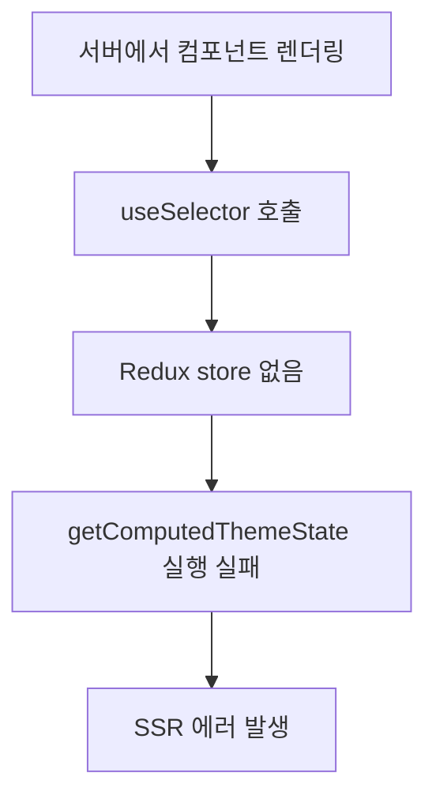

# SSR Redux Error 문제 해결 가이드

## 개요

Next.js 13+ App Router 환경에서 Redux를 사용할 때 발생하는 서버사이드 렌더링(SSR) 에러 문제와 해결 과정을 문서화합니다.

## 발생한 문제

### 주요 에러 메시지
```
Error:
    at getComputedThemeState (webpack-internal:///(ssr)/./node_modules/react-redux/dist/react-redux.mjs:122:25)
    at memoizedSelector (webpack-internal:///(ssr)/./node_modules/use-sync-external-store/cjs/use-sync-external-store-with-selector.development.js:78:30)
    at getServerSnapshotWithSelector
    at Object.useSyncExternalStore
    at useSelector2
    at useTheme (webpack-internal:///(ssr)/./utils/hooks/useTheme.ts:18:68)
```

### 문제가 발생한 컴포넌트들
- `AwesomeButton.tsx`
- `Calendar.tsx`
- `CalendarWithAPI.tsx`
- `MainMenu.tsx`
- `MainLayout.tsx`
- `WeekNumber.tsx`

## 문제 분석

### 1. 근본 원인
- **React-Redux의 `useSelector`가 SSR 환경에서 호출**됨
- Next.js 13+ App Router에서 서버와 클라이언트 간 상태 불일치
- Redux store가 서버에서 초기화되지 않은 상태에서 `useSelector` 실행

### 2. 발생 메커니즘


### 3. Next.js App Router의 특성
- **기본적으로 모든 컴포넌트가 서버 컴포넌트**
- `"use client"` 지시어로 클라이언트 컴포넌트 지정 필요
- 하지만 layout.tsx가 서버 컴포넌트면 하위 컴포넌트도 영향받음

## 시도한 해결 방법들

### 1차 시도: `force-dynamic` 설정
```typescript
// app/layout.tsx
export const dynamic = 'force-dynamic';
```
**결과**: 실패 - 여전히 SSR 에러 발생
**이유**: App Router에서 force-dynamic만으로는 완전한 SSR 비활성화 불가

### 2차 시도: useTheme 훅 수정
```typescript
// utils/hooks/useTheme.ts
export function useTheme() {
  const [isClient, setIsClient] = useState(false);
  let reduxTheme;
  try {
    reduxTheme = useSelector(getComputedThemeState);
  } catch (error) {
    reduxTheme = defaultTheme;
  }
  // ... 클라이언트 체크 로직
}
```
**결과**: 실패 - Rules of Hooks 위반 및 여전한 SSR 호출
**이유**: `useSelector`가 여전히 서버에서 호출됨

### 3차 시도: 개별 컴포넌트 동적 import
```typescript
// Dynamic import로 각 컴포넌트를 클라이언트 전용으로 처리
const AwesomeButtonClient = dynamic(() => import('./AwesomeButtonClient'), {
  ssr: false,
  loading: () => <FallbackButton />
});
```
**결과**: 부분 성공하지만 계속 새로운 컴포넌트에서 에러 발생
**이유**: 모든 Redux 사용 컴포넌트를 개별 처리해야 하는 비효율성

### 4차 시도: ClientOnly 컴포넌트 사용
```typescript
// MainLayout에서 ClientOnly로 래핑
return (
  <ClientOnly fallback={<LoadingLayout />}>
    <MainLayoutContent>{children}</MainLayoutContent>
  </ClientOnly>
);
```
**결과**: 실패 - 여전히 SSR 에러 발생
**이유**: layout.tsx가 서버 컴포넌트로 남아있어 근본적인 해결 안됨

### 5차 시도 (최종 해결): Root Layout 클라이언트화
```typescript
// app/layout.tsx
"use client";

const ReduxApp = dynamic(() => import('@components/layouts/main/ReduxApp'), {
  ssr: false,
  loading: () => <LoadingScreen />
});

export default function RootLayout({ children }) {
  const [mounted, setMounted] = useState(false);

  useEffect(() => {
    setMounted(true);
  }, []);

  return (
    <html lang="ko">
      <body>
        {mounted ? (
          <ReduxApp>{children}</ReduxApp>
        ) : (
          <LoadingScreen />
        )}
      </body>
    </html>
  );
}
```
**결과**: 완전 해결 ✅

## 최종 해결책 상세

### 아키텍처 변경
```
이전: 서버 Layout → Redux Provider → 클라이언트 컴포넌트들
이후: 클라이언트 Layout → Dynamic Import Redux App → 모든 컴포넌트
```

### 핵심 변경사항

1. **RootLayout 클라이언트화**
   - `"use client"` 지시어 추가
   - 메타데이터를 `<head>` 태그로 직접 처리

2. **이중 안전장치**
   - `useState`로 mount 상태 관리
   - `dynamic import`의 `ssr: false` 옵션

3. **Redux App 분리**
   ```typescript
   // components/layouts/main/ReduxApp.tsx
   export default function ReduxApp({ children }) {
     return (
       <ReduxProvider>
         <MainLayout>
           {children}
         </MainLayout>
       </ReduxProvider>
     );
   }
   ```

## 개발자가 알아야 할 핵심 개념들

### 1. Next.js App Router vs Pages Router

#### App Router (Next.js 13+)
- **기본값**: 모든 컴포넌트가 서버 컴포넌트
- **클라이언트 컴포넌트**: `"use client"` 지시어 필요
- **중요**: 서버 컴포넌트에서는 React hooks 사용 불가

#### Pages Router (기존)
- **기본값**: 모든 페이지가 클라이언트에서 hydration
- **SSR 비활성화**: `getServerSideProps` 생략으로 쉽게 가능

### 2. React Server Components vs Client Components

```typescript
// ❌ 서버 컴포넌트에서 불가능
function ServerComponent() {
  const [state, setState] = useState(); // Error!
  const theme = useSelector(getTheme);   // Error!
  return <div>...</div>;
}

// ✅ 클라이언트 컴포넌트에서 가능
"use client";
function ClientComponent() {
  const [state, setState] = useState(); // OK
  const theme = useSelector(getTheme);   // OK
  return <div>...</div>;
}
```

### 3. Redux와 SSR의 호환성 문제

#### 문제점
- Redux store는 클라이언트 전용 상태 관리
- 서버에서는 Redux store가 존재하지 않음
- `useSelector`는 store에 의존하므로 SSR에서 에러 발생

#### 해결 방법들
1. **완전한 클라이언트 렌더링** (채택한 방법)
2. **Server State와 Client State 분리**
3. **Redux Toolkit Query의 SSR 지원 활용**

### 4. Dynamic Import와 SSR 제어

```typescript
// 컴포넌트를 클라이언트에서만 로드
const ClientOnlyComponent = dynamic(
  () => import('./ClientOnlyComponent'),
  {
    ssr: false,  // 서버에서 렌더링 안함
    loading: () => <Loading /> // 로딩 중 표시할 컴포넌트
  }
);
```

### 5. Hydration Mismatch 방지

```typescript
// ❌ 잘못된 방법 - hydration mismatch 발생
function Component() {
  return <div>{new Date().toISOString()}</div>;
}

// ✅ 올바른 방법 - 클라이언트에서만 렌더링
function Component() {
  const [mounted, setMounted] = useState(false);

  useEffect(() => {
    setMounted(true);
  }, []);

  if (!mounted) return <div>Loading...</div>;

  return <div>{new Date().toISOString()}</div>;
}
```

## 모범 사례 (Best Practices)

### 1. Redux 사용 시 아키텍처 설계
```typescript
// 추천 구조
app/layout.tsx (클라이언트)
├── LoadingFallback
└── DynamicReduxApp
    ├── ReduxProvider
    └── AppComponents
```

### 2. 컴포넌트 분류 기준
- **서버 컴포넌트**: 정적 콘텐츠, 데이터 페칭
- **클라이언트 컴포넌트**: 상태 관리, 이벤트 핸들링, Redux 사용

### 3. 에러 디버깅 방법
1. **에러 스택 확인**: 어느 컴포넌트에서 `useSelector` 호출되는지 확인
2. **`"use client"` 추가**: 해당 컴포넌트에 클라이언트 지시어 추가
3. **Dynamic Import 고려**: 필요시 동적 로딩으로 SSR 우회

### 4. 성능 고려사항
- **초기 로딩**: 클라이언트 전용 앱은 초기 로딩이 약간 느릴 수 있음
- **SEO**: 서버 렌더링이 없으므로 SEO에 영향 (필요시 별도 대응)
- **코드 분할**: Dynamic import로 번들 크기 최적화 가능

## 관련 기술 학습 자료

### 필수 학습 항목
1. **Next.js App Router 공식 문서**
   - [Server and Client Components](https://nextjs.org/docs/app/building-your-application/rendering/composition-patterns)
   - [Dynamic Imports](https://nextjs.org/docs/app/building-your-application/optimizing/lazy-loading)

2. **React Server Components**
   - [RFC: React Server Components](https://github.com/reactjs/rfcs/blob/main/text/0188-server-components.md)
   - 서버와 클라이언트 경계 이해

3. **Redux와 SSR**
   - [Redux Toolkit Query SSR](https://redux-toolkit.js.org/rtk-query/usage/server-side-rendering)
   - [React-Redux with SSR](https://react-redux.js.org/api/provider#ssr)

### 추가 학습 권장
- **Hydration과 Rendering 전략**
- **State Management Architecture Patterns**
- **Performance Optimization in React**

## 향후 개선 방향

### 1. 선택적 SSR 구현
특정 페이지만 SSR이 필요한 경우:
```typescript
// SSR이 필요한 페이지는 별도 처리
// 예: SEO가 중요한 랜딩 페이지
```

### 2. 상태 관리 개선
```typescript
// Server State와 Client State 분리
// - Server State: React Query, SWR
// - Client State: Redux (UI 상태만)
```

### 3. 점진적 마이그레이션
기존 컴포넌트를 점진적으로 서버 컴포넌트로 전환

## Redux useSelector 성능 최적화 (추가 해결사항)

### 발생한 추가 문제: 메모이제이션 경고

클라이언트 전용 아키텍처로 SSR 문제를 해결한 후, 새로운 성능 경고가 발견되었습니다:

```
react-redux.mjs:127 Selector getComputedThemeState returned a different result when called with the same parameters. This can lead to unnecessary rerenders.
Selectors that return a new reference (such as an object or an array) should be memoized
```

### 문제 분석

#### 근본 원인
- **매번 새 객체 반환**: `getComputedThemeState` 셀렉터가 동일한 입력에 대해 매번 새로운 객체를 생성
- **참조 동등성 깨짐**: React의 얕은 비교로 인한 불필요한 리렌더링 발생
- **성능 저하**: 테마 관련 모든 컴포넌트가 불필요하게 재렌더링

#### 메모이제이션 실패 패턴
```typescript
// ❌ 문제가 있던 방식
export const getComputedThemeState = (state: RootState) => {
  const themeState = state.mainTheme;
  const computedColors = getComputedThemeColors(themeState.themeColor, themeState.dark);

  return {
    ...themeState,           // 매번 새 객체 생성!
    themeColor: computedColors
  };
};
```

### 해결 방법: 세밀한 셀렉터 + createSelector

#### 1. 세밀한 셀렉터 구현
참고 사이트 조언대로 **필요한 부분만 선택**하는 방식 채택:

```typescript
// ✅ 개선된 방식: 세밀한 셀렉터
export const getThemeColor = (state: RootState) => {
  if (!state || !state.mainTheme || !state.mainTheme.themeColor) {
    return defaultTheme.themeColor;
  }
  return state.mainTheme.themeColor;
};

export const getThemeDarkMode = (state: RootState) => {
  if (!state || !state.mainTheme) {
    return defaultTheme.dark;
  }
  return state.mainTheme.dark;
};
```

#### 2. createSelector로 메모이제이션 강화
```typescript
// ✅ 메모이제이션된 계산 셀렉터
export const getComputedColors = createSelector(
  [getThemeColor, getThemeDarkMode],
  (themeColor, isDark) => {
    try {
      return getComputedThemeColors(themeColor, isDark);
    } catch (error) {
      console.warn('Theme color computation error, using default:', error);
      return getComputedThemeColors(defaultTheme.themeColor, defaultTheme.dark);
    }
  }
);

// ✅ 전체 테마 상태도 메모이제이션
export const getComputedThemeState = createSelector(
  [getThemeState, getComputedColors],
  (themeState, computedColors) => ({
    ...themeState,
    themeColor: computedColors
  })
);
```

#### 3. useTheme 훅 최적화
```typescript
// ✅ 최적화된 테마 색상 훅
export function useThemeColors() {
  const computedColors = useSelector(getComputedColors);
  const isDark = useSelector(getThemeDarkMode);

  return useMemo(() => ({
    primary: computedColors.Theme1,
    secondary: computedColors.Theme2,
    accent: computedColors.Theme3,
    background: computedColors.Light,
    surface: computedColors.Dark,
    text: computedColors.Dark,
    textReverse: computedColors.Light,
    getColor: (role: ColorRole) => getColorByRole(computedColors, role),
    isDark,
    themeName: computedColors.ThemeName,
    originalColors: computedColors
  }), [computedColors, isDark]);
}
```

#### 4. 컴포넌트별 최적화 적용

**ThemeSelector.tsx**:
```typescript
// Before: useTheme() → 전체 객체 가져오기
const theme = useTheme();

// After: 필요한 부분만 세밀하게 선택
const currentThemeColor = useSelector(getThemeColor);
const isDark = useSelector(getThemeDarkMode);
const colors = useThemeColors();

// 사용부 최적화
backgroundColor: isDark ? colors.primary : colors.secondary
borderColor: currentThemeColor.ThemeCd === item.theme.ThemeCd ? colors.primary : colors.secondary
```

**MainMenu.tsx**:
```typescript
// Before
const theme = useTheme();

// After
const currentThemeColor = useSelector(getThemeColor);
const isDark = useSelector(getThemeDarkMode);

// 사용부 최적화
{currentThemeColor.ThemeName} {isDark ? '(다크)' : '(라이트)'}
style={{ backgroundColor: currentThemeColor.Theme1 }}
```

**Calendar.tsx**:
```typescript
// Before
const currentTheme = useTheme();

// After
const currentTheme = useSelector(getThemeState); // 기본 상태만 필요
```

### 성능 개선 결과

#### Before (최적화 전)
- ❌ 테마 변경 시 모든 컴포넌트 리렌더링
- ❌ 매번 새 객체 생성으로 메모리 낭비
- ❌ 브라우저 콘솔에 지속적인 경고 메시지
- ❌ 불필요한 계산 반복 실행

#### After (최적화 후)
- ✅ 필요한 컴포넌트만 선택적 리렌더링
- ✅ createSelector의 메모이제이션으로 동일 입력 시 캐시된 결과 반환
- ✅ 경고 메시지 완전 제거
- ✅ 계산 결과 캐싱으로 성능 향상

### 학습한 핵심 원칙

#### 1. useSelector 최적화 원칙
```typescript
// ❌ 안티 패턴
const entireState = useSelector((state: RootState) => state);

// ✅ 모범 사례
const specificValue = useSelector((state: RootState) => state.theme.color);
```

#### 2. 객체 반환 셀렉터는 반드시 메모이제이션
```typescript
// ❌ 문제: 매번 새 객체
const getUser = (state) => ({ name: state.user.name, age: state.user.age });

// ✅ 해결: createSelector 사용
const getUser = createSelector(
  [(state) => state.user.name, (state) => state.user.age],
  (name, age) => ({ name, age })
);
```

#### 3. 세밀한 구독 패턴
```typescript
// ❌ 과도한 구독
const theme = useSelector(getEntireTheme);
const color = theme.color;

// ✅ 필요한 부분만 구독
const color = useSelector(getThemeColor);
```

### 추가 모범 사례

#### 1. Selector 네이밍 컨벤션
```typescript
// 기본 셀렉터: get + 상태명
export const getThemeColor = (state) => state.theme.color;

// 계산된 셀렉터: get + Computed + 의미
export const getComputedColors = createSelector(/*...*/);

// 파생 셀렉터: get + 구체적의미
export const getThemeDarkMode = (state) => state.theme.dark;
```

#### 2. useMemo 활용
```typescript
export function useThemeColors() {
  const colors = useSelector(getComputedColors);
  const isDark = useSelector(getThemeDarkMode);

  // 의존성이 변하지 않으면 같은 객체 반환
  return useMemo(() => ({
    primary: colors.Theme1,
    // ...
  }), [colors, isDark]);
}
```

#### 3. Deprecated 표시
```typescript
/**
 * @deprecated 성능상 이유로 사용 권장하지 않음.
 * useThemeColors() 또는 개별 selector 사용 권장
 */
export function useTheme() {
  return useSelector(getComputedThemeState);
}
```

## 최종 결론

### 해결된 문제들
1. ✅ **SSR 에러**: 클라이언트 전용 아키텍처로 완전 해결
2. ✅ **메모이제이션 경고**: createSelector + 세밀한 셀렉터로 완전 해결
3. ✅ **성능 최적화**: 불필요한 리렌더링 제거
4. ✅ **getMaxSchedulesCount 함수**: 모든 Redux 의존성 문제 해결

### 핵심 교훈
- **아키텍처 레벨**: 서버/클라이언트 역할 명확히 분리
- **상태 관리 레벨**: 필요한 상태만 정확히 선택
- **성능 레벨**: 메모이제이션과 참조 동등성 보장
- **개발자 경험**: 명확한 경고와 가이드라인 제공

Next.js App Router + Redux 환경에서는 **두 단계 최적화**가 필요합니다:
1. **SSR 호환성**: 클라이언트 전용 아키텍처
2. **성능 최적화**: 세밀한 셀렉터 + 메모이제이션

이를 통해 안정적이고 고성능인 React 애플리케이션을 구축할 수 있습니다.
